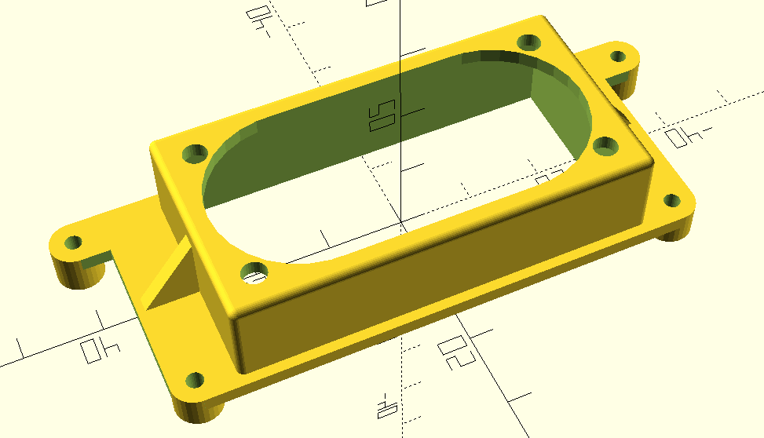

# very-cool-heatsink-adapter

This project intends to provides a 3D model of a plastic piece to adapt a Raspberry Pi heatsink on a Toradex Verdin board for evaluation purpose. This is an **experimental project only**, not intended to be used on production.

The target heatsink can be found on differente marketplaces under the name [Aokin Raspberry Pi 4 Model B Dual Fan with Heatsink](https://www.aliexpress.com/i/4000401940976.html).

This project uses [Daniel Upshaw's Rounded Corners OpenSCAD library](https://danielupshaw.com/openscad-rounded-corners/)

